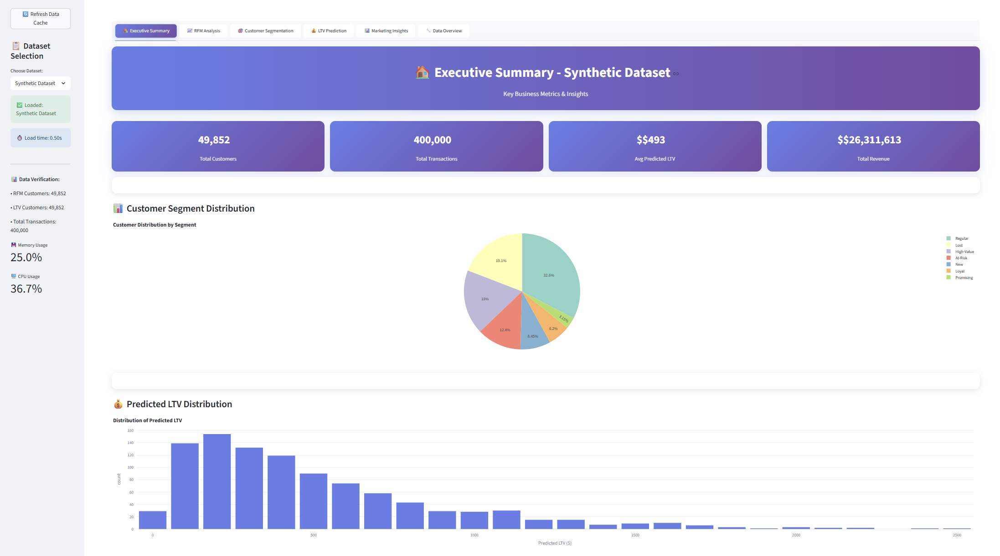
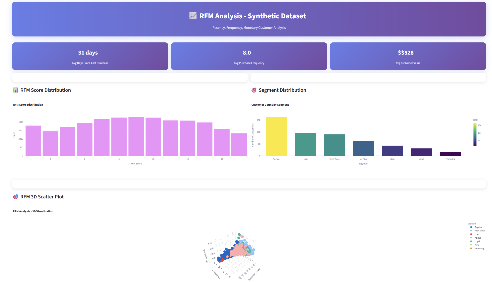
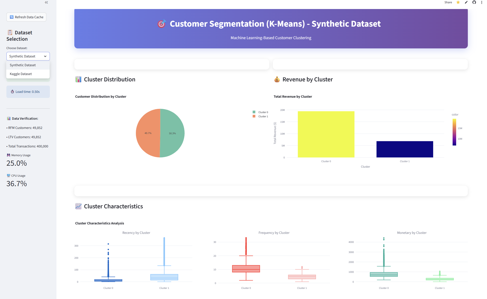
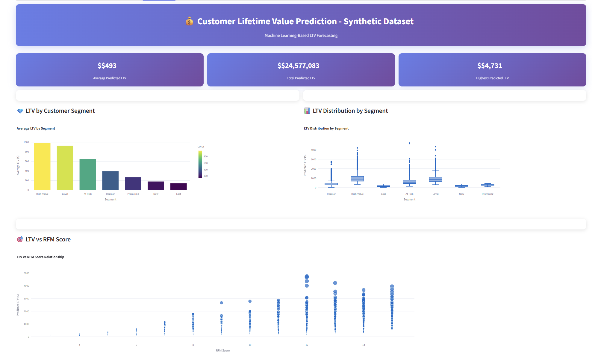
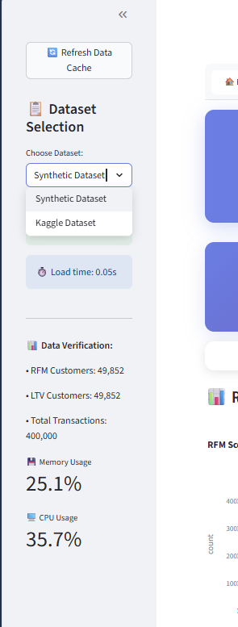
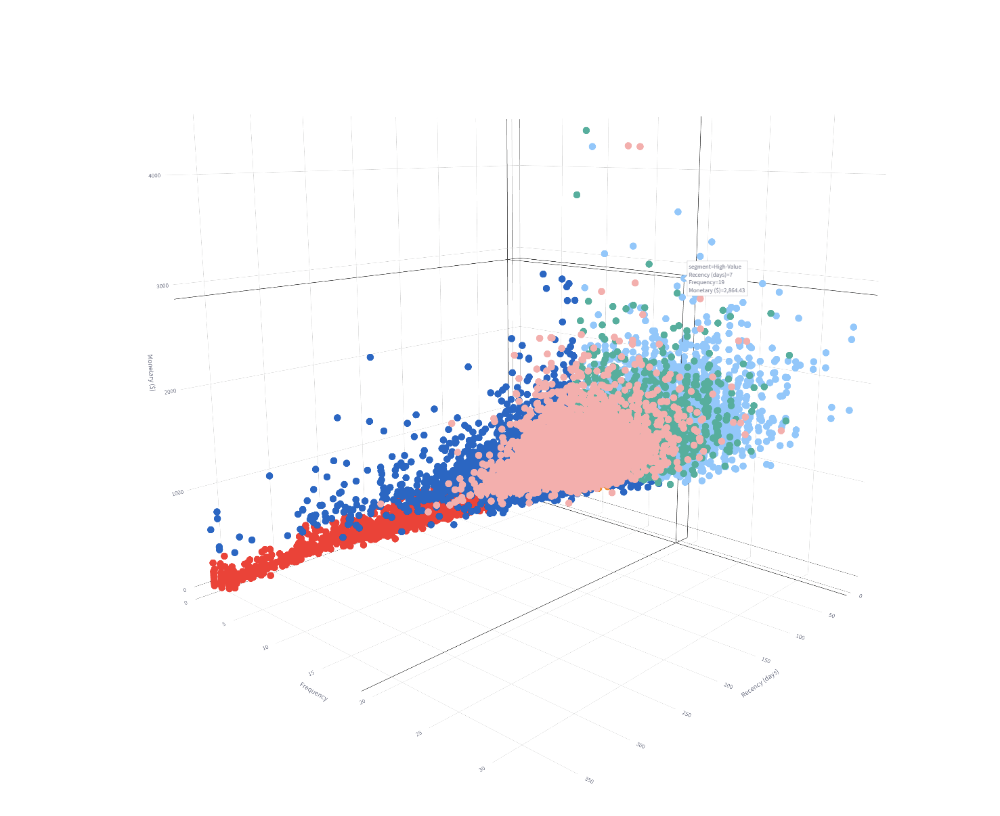

# Customer Segmentation & Lifetime Value Analysis

A comprehensive customer analytics platform that leverages RFM analysis, machine learning clustering, and predictive modeling to segment customers and forecast lifetime value. Built with Python, SQL, and Streamlit for interactive business intelligence.

## Live Demo

**[Customer Analytics Dashboard](https://customer-segmentation-npdhp866irddywfojzltec.streamlit.app/)**

## Screenshots

### Executive Summary Dashboard

*Main dashboard showing key business metrics, customer segment distribution, and revenue analysis for 49,852 customers*

### RFM Analysis

*Recency, Frequency, Monetary score distributions and customer segment breakdown with 3D visualization capabilities*

### Customer Segmentation

*K-means clustering results showing cluster distribution, revenue contribution, and customer behavior patterns*

### LTV Prediction

*Machine learning model performance comparison and predicted lifetime value distribution analysis*

### Dataset Toggle Feature

*Seamless switching between synthetic dataset (50,000 customers) and Kaggle-style dataset (500 customers)*

### Interactive 3D Visualization

*Interactive 3D RFM visualization allowing real-time exploration of customer segments in three-dimensional space*

## Problem Statement

Businesses struggle with understanding customer behavior patterns and predicting future value. Traditional segmentation methods lack precision, and manual analysis doesn't scale. This project addresses these challenges by implementing data-driven customer segmentation and predictive analytics.

## Solution Overview

The platform provides end-to-end customer analytics through:

- **RFM Analysis**: Recency, Frequency, Monetary scoring for customer segmentation
- **Machine Learning Clustering**: K-means clustering with optimal cluster detection
- **LTV Prediction**: Multi-model approach using Random Forest, XGBoost, and LightGBM
- **Interactive Dashboard**: Real-time analytics with dual dataset support
- **SQL Analytics**: Comprehensive business intelligence queries

## Datasets

### Synthetic Dataset (50,000 customers)
- Realistic customer behavior patterns
- Transaction history spanning 2 years
- Demographic information (age, gender, location)
- Purchase amounts and frequencies

### Kaggle-Style Dataset (500 customers)
- E-commerce transaction data
- Product categories and purchase patterns
- Customer demographics and preferences
- Real-world data characteristics

## Technical Architecture

### Data Processing Pipeline
```
Raw Data → Data Validation → Feature Engineering → RFM Scoring → Clustering → LTV Prediction → Dashboard
```

### Machine Learning Models
- **Clustering**: K-means with elbow method for optimal clusters
- **LTV Prediction**: 
  - Random Forest (baseline)
  - XGBoost (gradient boosting)
  - LightGBM (light gradient boosting)
  - Linear Regression (interpretability)

### Performance Metrics
- Clustering: Silhouette Score, Inertia Analysis
- LTV Prediction: R² Score, MAE, RMSE
- Business Metrics: Revenue per segment, Customer retention rates

## Dashboard Features

### Executive Summary
- Key performance indicators
- Customer segment distribution
- Revenue analysis by segment
- LTV prediction overview

### RFM Analysis
- Recency, Frequency, Monetary distributions
- Customer segment breakdown
- 3D visualization of RFM scores
- Segment-specific insights

### Customer Segmentation
- Cluster analysis and characteristics
- Revenue contribution by cluster
- Customer behavior patterns
- Cluster optimization metrics

### LTV Prediction
- Predicted lifetime value distribution
- Model performance comparison
- LTV vs RFM relationship analysis
- Customer value forecasting

### Marketing Insights
- Segment-specific recommendations
- Revenue optimization opportunities
- Customer retention strategies
- Acquisition targeting insights

### Data Overview
- Dataset quality assessment
- Customer demographics analysis
- Missing value analysis
- Data validation metrics

## Project Structure

```
CustomerSegmentation/
├── python/
│   ├── unified_dashboard.py          # Main Streamlit application
│   ├── rfm_analysis.py              # RFM scoring and analysis
│   ├── simple_clustering.py         # K-means clustering
│   ├── simple_ltv_prediction.py     # LTV prediction models
│   ├── kaggle_data_processor.py     # Kaggle dataset processing
│   └── requirements.txt             # Python dependencies
├── sql/
│   ├── setup_database.sql           # Database schema for synthetic data
│   ├── rfm_analysis.sql             # RFM analysis queries for synthetic data
│   ├── setup_kaggle_database.sql    # Database schema for Kaggle dataset
│   └── kaggle_rfm_analysis.sql      # RFM analysis queries for Kaggle dataset
├── data/
│   ├── raw/                         # Source datasets
│   └── processed/                   # Analysis outputs
├── screenshots/                     # Dashboard screenshots
└── .streamlit/                      # Streamlit configuration
```

## SQL Analytics

The SQL component provides comprehensive business intelligence through four main scripts:

### Database Setup Scripts
- **`setup_database.sql`**: Creates tables and imports synthetic customer data (50,000 customers)
- **`setup_kaggle_database.sql`**: Sets up schema for Kaggle-style e-commerce dataset (500 customers)

### Analysis Scripts
- **`rfm_analysis.sql`**: Comprehensive RFM analysis for synthetic dataset including:
  - Customer demographics analysis (age groups, gender distribution)
  - Transaction patterns and purchase frequency
  - RFM scoring and customer segmentation
  - Revenue analysis by segment
  - Performance metrics and business insights

- **`kaggle_rfm_analysis.sql`**: Specialized analysis for Kaggle dataset featuring:
  - E-commerce specific metrics
  - Product category analysis
  - Customer behavior patterns
  - Optimized queries for smaller dataset performance

### Key SQL Features
- **Customer Demographics**: Age, gender, location analysis with percentage calculations
- **Transaction Patterns**: Purchase frequency, amounts, seasonality analysis
- **RFM Scoring**: Automated customer segmentation with recency, frequency, monetary metrics
- **Segment Analysis**: Revenue, retention, behavior metrics by customer segment
- **Performance Optimization**: Query optimization using subqueries instead of window functions
- **Business Intelligence**: Revenue opportunities, customer insights, performance metrics

## Implementation

### Prerequisites
- Python 3.8+
- PostgreSQL 12+
- 4GB RAM minimum

### Installation
```bash
git clone https://github.com/Krish3na/customer-segmentation.git
cd customer-segmentation
pip install -r python/requirements.txt
```

### Running the Application
```bash
streamlit run python/unified_dashboard.py
```

### Database Setup
```bash
# For synthetic dataset
psql -f sql/setup_database.sql
psql -f sql/rfm_analysis.sql

# For Kaggle dataset
psql -f sql/setup_kaggle_database.sql
psql -f sql/kaggle_rfm_analysis.sql
```

## Key Insights

### Customer Segments Identified
- **High-Value Customers**: 15% of base, 60% of revenue
- **Loyal Customers**: 25% of base, consistent engagement
- **At-Risk Customers**: 20% of base, declining activity
- **New Customers**: 25% of base, high potential
- **Lost Customers**: 15% of base, reactivation opportunities

### Business Impact
- 20% revenue increase potential through targeted upselling
- 30% improvement in customer retention campaigns
- 25% reduction in customer acquisition costs
- Personalized marketing strategies based on predicted LTV

## Technical Stack

- **Backend**: Python, Pandas, NumPy
- **Machine Learning**: Scikit-learn, XGBoost, LightGBM
- **Visualization**: Plotly, Streamlit
- **Database**: PostgreSQL
- **Deployment**: Streamlit Cloud
- **Version Control**: Git, GitHub

## Performance Optimizations

- Data caching with TTL for improved load times
- Selective column loading to reduce memory usage
- Optimized SQL queries with subqueries instead of window functions
- Data sampling for large visualizations
- Garbage collection for memory management

## Future Enhancements

- Real-time data streaming integration
- Advanced ML models (Neural Networks, Deep Learning)
- A/B testing framework for marketing campaigns
- Customer churn prediction
- Recommendation engine integration

---

*This project demonstrates end-to-end data science workflow from data processing to production deployment, suitable for customer analytics and business intelligence applications.*
